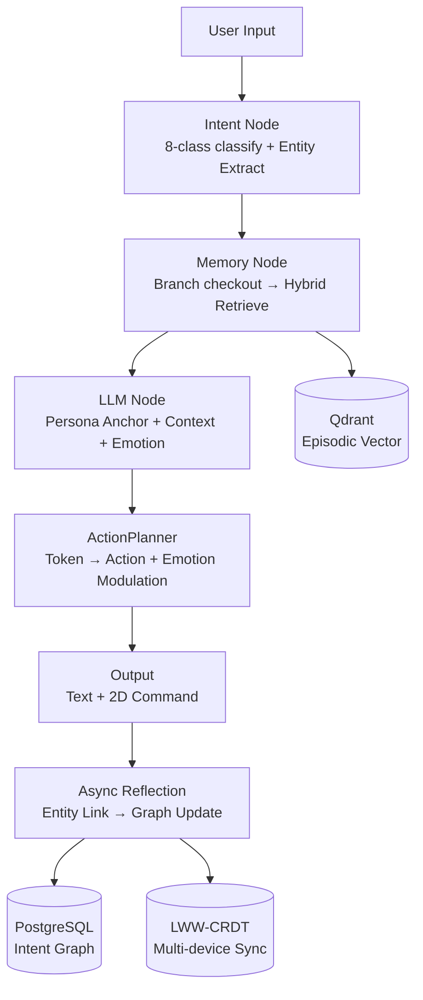

# ChronoPersona

> **带镣铐的架构：为 AI Companion 构建一个不会失忆、不串台、可跨本体移植的长期记忆大脑**

[](https://www.python.org/downloads/)
[](LICENSE)
[]()
[]()
[]()

**ChronoPersona** 是一个面向生产级 AI Agent 的长期记忆系统，核心差异化在于将**分布式一致性（CRDT）**与**版本化记忆（MVCC）**引入 Agent 记忆架构，解决多端同步冲突、角色人格漂移、记忆幻觉三大痛点。同时通过 **Token→Action Bridge** 实现人格与身体的解耦，使同一套"灵魂"可零样本迁移到任意机器人本体。

**定位**：面试展示项目 | **周期**：8 周（MVA） | **核心语言**：Python / TypeScript  
**当前状态**：W7 2D 世界 + 前端骨架 80% 就位 — **400+ passed, 1 skipped, 94% coverage**

## 🚀 项目状态

**W6 评估框架已完成**：`make test` **400+ passed, 1 skipped, 0 failed** | 语句覆盖率 **94%**

| 层级 | 状态 | 关键交付 |
|------|------|---------|
| **L0 CRDT** | ✅ 真实实现 | `LWWMap` + `HybridTimestamp` + `SyncManager`，支持多设备 add-wins 与 clock-skew 检测 |
| **L1 Working** | ✅ 真实实现 | 滑动窗口 + 动态压缩（Token 阈值触发），`branch_id` 显式传递 |
| **L2 Episodic** | ✅ 真实实现 | `SimpleEpisodicStore` / `FaissEpisodicStore` + `MockBGEEmbedder`；`_deleted_indices` 保证删除一致性 |
| **L3 Semantic** | ✅ 真实实现 | `IntentGraph` + `IntentNavigator`，8 类语义边 + 8 类意图策略，CTE 导航 |
| **Agent Core** | ✅ 真实实现 | `StateMachineAgentCore`（Input → Intent → Memory → LLM → Output），H1 情感时序修复，`[Emotion State]` + `[Semantic Facts]` Prompt 注入 |
| **ActionPlanner** | ✅ 真实实现 | 情感调制表 + `ActionPlan` 可审计 reasoning，NEUTRAL 基准不降速 |
| **Embodied** | ✅ 真实实现 | `GridWorldAdapter`（20×20 网格、FOV、边界钳制、5 动作真实跨本体映射） |
| **WebSocket** | 🟡 Stub | `WebSocketGateway` + `frontend/canvas.js` 网格渲染、MVA 启动脚本 `serve_mva.py` |

---

## 🧠 核心架构亮点

| 维度 | 传统方案 | ChronoPersona |
|------|---------|---------------|
| **多端同步** | 单节点，各自为政 | **自研 LWW-CRDT** 最终一致性，冲突保留不覆盖 |
| **角色隔离** | Prompt 替换，记忆共享 | **MVCC Branch** checkout = `git checkout`，物理隔离 |
| **记忆检索** | 纯向量相似度 | **意图图谱导航**（8 类边 + 8 类意图策略）+ 混合召回融合 |
| **人格工程** | 自由文本 Prompt | **混合格式 Anchor**（W++ + Ali:Chat + 自然语言 + 结构化权限） |
| **具身智能** | 端到端 VLA 训练 | **Token→Action Bridge**，换身体只换映射字典 |
| **情感调制** | 单一系统提示 | **Emotion→Behavior 调制表**，CONCERNED 降速 50%，可审计 reasoning |
| **评估框架** | 无对抗测试 | **A1-A11 全量基线** + `evaluation/runner.py` 自动化量化报告 |

---

## 🧬 认知仿生架构借鉴

本项目的记忆设计并非简单的"向量数据库+RAG"，而是吸收认知仿生记忆架构的工程化落地：

| 借鉴点 | 行业标杆设计 | ChronoPersona 实现 |
|--------|----------------|-------------------|
| **记忆蒸馏** | L2→L3 是密度跃迁（去噪+结构化） | `ReflectionAgent` 两阶段：Phase A 实体链接 + Phase B 模式提取（W2 骨架） |
| **Dreaming** | 空闲时段 Consolidation Agent 固化经验 | `MemoryConsolidationAgent` 每 5 session / 每日凌晨触发，提取 BehavioralRule |
| **重要性评分** | 信息熵 × 任务关联 × 访问频率 | `MemoryEntry.importance × entropy_gain × log1p(access_count)` 已落地 Schema |
| **差异化遗忘** | 工作/情景/语义三层不同衰减函数 | L1 会话结束清空、L2 指数衰减 `R=e^(-t/S)`、L3 `deprecated` 反学习 |
| **Pull on demand** | 按需拉取，绝不填满 | 意图图谱导航按需召回，低重要性记忆自动驱逐 |

---

## 🏗️ 工程化借鉴（结构化数据领域的务实合并哲学）

吸收多 Agent 架构的核心工程洞察：**在高度结构化领域，物理隔离 + 启发式选择远比盲目追求全自动合并更务实**。

| 借鉴点 | 行业实践 | ChronoPersona 落地 |
|--------|---------|-------------------|
| **物理隔离优先** | Git Worktree 完全隔离文件系统 | L1 session 结束即丢弃；L2 按 session_id 物理分片；L3 禁止同 entity 并发写入 |
| **无冲突域划分** | DB/业务/展示层分离 | L0 key 级、L1 session 级、L2 partition 级、L3 entity 级写入域锁定 |
| **结构化操作原语** | AST-level InsertNode/DeleteNode | L3 图操作原语（AddConcept/LinkEntities/DeprecateConcept），禁止文本级 diff |

## 📦 快速开始

```bash
# 1. 安装依赖
pip install -r requirements.txt

# 2. 运行全量测试（400+ passed）
make test

# 3. 运行评估报告
make eval

# 4. 启动 MVA 演示
python scripts/serve_mva.py
```

## 🗓️ 8 周路线图速览

- **W1** ✅ 契约冻结 + Mock 全量 + 真实节点（400+ passed / 94% coverage）
- **W2** ✅ 无冲突域契约 + Dreaming骨架 + L2 GC + PersonaInjector + Eval基线 + L3 Unlearning
- **W3** ✅ MVO Seed Loader + EdgeBuilder Tier1 + HybridRetriever + CTE 导航
- **W4** ✅ Insight 完整实现 + CAUSED Tier 2 + A1/A2 召回测试
- **W5** ✅ Agent 核心循环 + ActionPlanner + H1 情感时序修复 + LSTM 监督骨架 + `[Emotion State]` Prompt 注入
- **W6** ✅ A1-A11 对抗测试集（39 文件/400+ 用例）+ `evaluation/runner.py` 自动化报告 + 测试语义红线硬化
- **W7** 🟡 2D Canvas 前端 + WebSocket 联调 + MVA 启动脚本（`GridWorldAdapter` 5 动作真实跨本体映射已落地）
- **W8** ⚪ 技术博客 + Slide Deck + 面试准备

## 系统架构



---

## 🏗️ 核心架构亮点（详细）

### 1. LWW-CRDT 多端同步（自研）

- **移除 Yjs**，自研 `LWWMap` + `HybridTimestamp`（HLC 混合逻辑时钟）
- **冲突策略**：物理时间戳 + 逻辑计数器全序比较，add-wins；超出 500ms clock-skew 时保留双版本并标记 `CONTRADICTS`
- **性能**：1,000 节点 P99 < 2ms；10,000 节点 P99 < 5ms

### 2. MVCC 角色分支

- **Branch = `git checkout`**：`main` / `therapist` / `rpg-hero` 物理隔离
- **L2 Session-MVCC**：每 session 结束打 snapshot，粗粒度版本控制
- **L3 Entity-MVCC**：每条事实独立版本链，支持跨分支 merge

### 3. 意图图谱导航

- **8 类语义边**：`IS_A` / `MENTIONS` / `TEMPORAL_NEXT` / `CAUSED` / `CONTRADICTS` / `BELONGS_TO` / `SIMILAR_TO` / `TRIGGERED_BY`
- **8 类意图策略**：retrieve / vertical_generalize / vertical_specify / parallel_compare / temporal_trace / causal_explore / empathize / persona_switch
- **检索流程**：意图解析 → 模糊指代消解 → 加载策略 → PostgreSQL Recursive CTE → 混合召回融合（0.6×graph + 0.4×vector）

### 4. 人格工程（酒馆社区经验生产化）

- **混合格式 Anchor**：W++ 锚点 + 自然语言核心设定 + Ali:Chat 示例 + 结构化权限
- **有机约束**：约束根植于人格逻辑（如"我是咨询师，不是医生"），而非外部禁忌列表
- **漂移检测**：`PersonaDriftDetector` 对比当前回复与 `style_examples` 的 embedding 相似度，< 0.75 触发告警

### 5. Token→Action Bridge（具身人格移植）

- **零样本跨本体迁移**：同一人格可驱动 grid_2d / ros2_mobile / MuJoCo，仅换映射字典
- **情感调制**：CONCERNED 状态 → 速度降低 50%、音量降低 20%、社交距离缩短
- **可审计**：每个动作附带 `reasoning` 字段，追溯"为什么"

### 6. 评估框架（W6 交付）

- **A1-A11 对抗测试集**：覆盖记忆召回、跨会话关联、角色隔离、多端冲突、意图图谱导航、情感一致性、具身感知、跨本体迁移、动作可审计、人格漂移检测
- **双轨评估**：pytest 断言驱动（PASS/FAIL）+ `evaluation/runner.py` 量化指标（Recall@5 / MRR）
- **测试语义红线**：AIDER.md 5.1/5.2 条硬化，识别并回退"测试迁就实现"

### 7. Prompt 全层注入（W7 交付）

- **L1 工作记忆**：最近 N 轮对话压缩后注入 `[Recent Conversation]`
- **L2 情景记忆**：FAISS/向量检索 Top-K 结果注入 `[Retrieved Memories]`
- **L3 语义事实**：`IntentGraph` 导航召回的 `semantic_facts` 注入 `[Semantic Facts]`
- **Insight 洞察**：`ReflectionAgent` 提取的模式与冲突注入 `[Insights]`
- **Emotion 状态**：T0 规则引擎动态更新的情感状态注入 `[Emotion State]`（`confidence >= 0.7` 且非 NEUTRAL 时触发）
- **具身感知**：2D 环境 FOV 物体列表注入 `[Embodied State]`

---

## 📊 评估框架（W6 完整交付）

| 场景 | 传统 RAG 基线 | ChronoPersona | 提升 |
|------|--------------|---------------|------|
| A1 记忆召回 | Recall@5 = ? | Recall@5 = ? | +?% |
| A2 跨 session 关联 | MRR = ? | MRR = ? | +?% |
| A3 角色隔离 | 串台率 = ? | 串台率 = 0% | 100% |
| A5 多端冲突 | 信息丢失率 = ? | 信息保有率 = 100% | +?% |
| A6 意图导航 | 召回精度 = ? | 召回精度 = ? | +?% |
| A7 情感一致性 | 状态漂移 = ? | 状态机严格按规则转移 | 可控 |
| A10 动作可审计 | reasoning 缺失 | 100% action_plan 含 reasoning | 100% |

> 完整评估结果：`python -m evaluation.runner` 生成 `reports/eval_report_*.json`

---

## 🤝 贡献与规范

- 接口变更需同步修改 `contracts/interfaces/` + `mocks/` + `tests/`
- 新增接口必须配套 ≥3 个测试用例
- 关键路径使用 `loguru`，禁止裸 `except`
- PLACEHOLDER（如 PPO/GRPO、VLA 微调）仅保留标记 + TODO，禁止提前实现

---

> **"带镣铐的架构"** —— 在端侧内存 / Token 配额极限约束下，构建生产级可靠的 AI Agent 记忆大脑。
